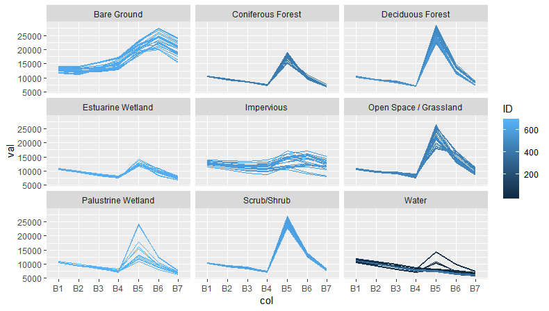

```{r setup, include=FALSE}
knitr::opts_chunk$set(echo = TRUE)
```
## Introduction 

Landcover mapping based on aerial photographs and ground truth survey is a time consuming process with inherent problems. Large projects require the acquisition and processing of potentially thousands of aerial photos.  Human interpretation takes many hours and is subject to human perception and bias.  Satellite imagery and machine learning algorithms, have been used to create landcover maps for use on a wide variety of environmental projects. Satellite imagery typically covers large areas allowing a single image to cover most study areas.  Landsat Thematic Mapper imagery can be used to classify landcover but is limited due to spatial resolution of 30 meters (ground pixel).  

This project will use the Random Forest Classifier and selected bands from a Landsat 8 TM image of Martha's Vineyard Massachusetts to attempt to predict 9 landcover classes.  The prediction will be based on spectral response across bands 1 - 7 of the image. The training data will be based on polygons drawn on areas of  known landcover interpreted from aerial photos. The polygons will capture the spectral response of pixels of known landcover and these pixels will be used to train a model.  A smaller subset image of the island of Martha's Vineyard was used in order to speed processing and get around large file sizes for this project.  Training pixels were selected based on known landcover areas and a model was created based on the spectral response to predict landcover. The final model will be used to classify the entire image and an accuracy assessment will be performed using landcover ground truth data interpreted from aerial photographs by the state of Massachusetts Department of Environmental Protection.

## Dataset Summary

Since 1972, the NASA Landsat program has imaged the earth at varying spectral, and spatial resolutions using a series of satellites. LandSat 8 was launched in 2013 and includes 11 bands of spectral information in the visible and infrared spectrum.  The imaging scanner collects pixels of reflected light at a fairly course spatial resolution (30 meters ground sampling unit depending on the band) but this allows large swaths of the earth to be recorded on a regular basis and provides ready to analyze images for use in many applications.  For this project, I have acquired a single path/row image in the form of individual tiff image files.  Each band the satellite covers is a separate tiff file. Th bands represent reflectance in a narrow section of the electromagnetic spectrum.  The band/wavelength breakdown for the bands used in the project and potential uses of each band are as follows.


The Landsat Thematic Mapper 8 satellite also records additional bands that I will not use in this project. Bands 8, 9, 10, 11 are of varying spatial and spectral resolutions but are typically used for additional visual detail, cloud identification, and Thermal information. A single Landsat 8 image of Path 012 Row 031 acquired on July 13, 2016 was chosen for the project.  A 2016 image was chosen because a comprehensive landcover map from 2016 was available to use as ground truth for the project.  A July image was chosen to insure that a significant amount of vegetation would be visible by the sensor, in hopes that it might allow for better separation of image landcover classes. The image was downloaded from the [USGS](https://earthexplorer.usgs.gov/) website  

The size of each LandSat Path/Row including all 11 bands is well over 1.5 GB in size.  In order to make things more manageable for this project I acquired the image from the USGS website and pre-processed each bands tiff image.  The images were clipped with a study area feature class stored in an ESRI file Geodatabase.  The result was 7 tiffs with over 800,000 pixels per image but at a much more reasonable 2MB per image.  As shown in Table 1 each band measures reflectance in a narrow band of the electromagnetic spectrum.  The red (band 4), green (band 3),  and blue (band2), bands provide info in the visible spectrum but bands 5, 6, and 7 are outside the human eyes visible range.  These bands help with plant identification, plant health, moisture content and mineral identification.  Overall it is hoped that the spectral response across all 7 bands will be useful in predicting landcover at the site of each pixel.  

For this project a set of generalized landcover types were used.  Table 2 shows the Selected Landcover types used in this project.


Each band used in this project was provided as a single panchromatic image where the lowest response pixels are black (near 0 reflectance value) or near black and the highest response are white or near white. In addition to reflectance values the images are georeferenced meaning that the pixels are tied to latitude and longitude locations on the ground. The individual pixels values for each band are stored and so are coordinates for the center of the pixel. This allows users to drape the tif images over a map with the necessary software packages.  The classified image can be draped over the 2016 ground truth data for a pixel to pixel comparison. The data was processed into separate geotiff files for each band and was imported into a spatial dataframe in r with the following code:


```{r import, eval=FALSE}
# Load R libraries for the project
if(!require(rgdal)){
  install.packages("rgdal")
  library(rgdal)
}

if(!require(raster)){
  install.packages("raster")
  library(raster)
}

if(!require(caret)){
  install.packages("caret")
  library(caret)
}


#set subset Image file location
path <- "./SubsetImagery/"
setwd(path)

#import each tif file into a spatial grid dataframe
new_B1 <- readGDAL("band1.tif")
new_B2 <- readGDAL("band2.tif")
new_B3 <- readGDAL("band3.tif")
new_B4 <- readGDAL("band4.tif")
new_B5 <- readGDAL("band5.tif")
new_B6 <- readGDAL("band6.tif")
new_B7 <- readGDAL("band7.tif")
```


The import (readGDAL) makes use of several R libraries specifically the rgdal and raster packages.  These must be loaded in order to import the individual tif files. After the upload is complete, each band is stored in a spatial grid data frame. rgdal and raster are R packages that handle raster and vector data. These packages are the basis for a lot of geospatial programming techniques in R.

The code below displays a single band (spatial grid dataframe) using the plot command.  Band 5 covers the Near Infrared and is outside the visible spectrum.  It is useful for analyzing vegetation and plant health.


``` {r band5, eval=FALSE}
plot(new_B5,col = gray(0:100 / 100))
```


Once each tif file is imported into a spatial grid dataframe each individual dataframe is converted into a raster layer and then stacked into a single raster stack with 7 dimensions using the code below.

```{r stack, eval = FALSE}
FullImage <- stack(raster(new_B1), raster(new_B2), raster(new_B3)
                   , raster(new_B4), raster(new_B5), raster(new_B6), 
                   raster(new_B7))

# update the names of the raster stack to a simpler B1 - B7
names(FullImage) <- paste0("B", c(1:7))
```


The result is a raster stack with dimensions of 724 rows and 1132 columns. The image has a total of 819,568 pixels  and 7 layers (one for each band B1 - B7).  The original image (full size image before study area clipping) was 8011 rows and 7901 columns (63,294,911 pixels).  Landsat imagery can be quite cumbersome to store and handle and for this reason for this project I used a smaller subset that centered on the island of Martha's Vineyard.

An image can be Visually interpreted using the computer screen. A single panchromatic band (like band 5 above) is mapped to the blue, red, or green display of the computer screen and in combination with other bands results in a raster stack that can be viewed and intepreted. A true color image can be displayed by matching band 4 to red, band 3 to green and band 2 to blue. (4,3,2). 

A true color image can be stacked with the following code:

```{r truecolor, eval = FALSE}
plotRGB(FullImage * (FullImage >= 0)
        , r = 4, g = 3, b = 2
        , stretch ='lin')
```


While the near infrared and short wave infrared bands are not in the range of light the eye can see, we can create a pseudo color image using the screen colors and map the NIR and SWIR bands to the visible red, green, or blue display of the computer screen and visually interpret the image.

The following code creates a false color image:

```{r falsecolor, eval = FALSE}
plotRGB(FullImage * (FullImage >= 0)
        , r = 5, g = 4, b = 3
        , scale = 2
        , stretch ='lin')
```


## Methodology - Model Creation and Training Methodology

After processing the input data and importing it into R the next step was to identify training areas on the image that identify known landcover types.

Again the landcover types I am attempting to predict are the following: 

1 - Impervious Surfaces  
2 - Developed Open areas / Grassland  
3 - Deciduous Forest  
4 - Coniferous Forest  
5 - Scrub/Shrub  
6 - Palustrine Wetland (Non salt water wetland)  
7 - Estuarine Wetland (salt water wetland)  
8 - Bare Ground (Sand, Exposed Dirt)  
9 - Water  

The first step in creating the model was to collect pixel reflectance values for areas of known landcover (training areas). Since the imagery is georeferenced to locations on the ground we can use other georeferenced imagery (in this case aerial photographs) to identify suitable training areas of the known landcover classes in this project. Training polygons for the study were acquired for each landcover type using aerial photo interpretation. Polygons were drawn in GIS software to capture pixels of known landcover and their reflectance values were stored.  The polygons were stored in a ESRI feature class and will be imported into R as a spatial polygons dataframe (using rgdal / ogr) the polygons were used to extract pixels from the study area image.  

The polygons are included in the file geodatabase provided in the github repository for this project


A few of of the training polygons are shown in Figures 6, 7, and 8, below:  


Training polygons were identified over areas of pure landcover (for all 9 landcover types) and the polygons were used to extract reflectance information over the much coarser resolution (30 meter pixel) Satellite image used in the project.

The final set of training polygons was imported into R with the following code:

```{r trainingSets, eval=FALSE}
fgdb <- "../GISData.gdb"  # set the location of the file geodatabase
TrainingPixels <- readOGR(dsn=fgdb, "MVTrainingAreas")
```

TrainingPixels is a spatial Polygons dataframe that identifies areas on the ground that correspond to the 9 landcover types we are attempting to identify.  Each polygon is tagged with it's landcover code 1 - 9 
This set of polygons was used to pull reflectance values from the satellite image across all 7 bands.  The 7 bands of reflectance values were pulled from pixels that fell inside the training areas. These values were input into a dataframe. 

The following code creates a dataframe that holds the pixel values and a class number for each of the above landcover types  

``` {r pixelExtract, eval=FALSE}
responseCol <- "CovCode"

dfTraining = data.frame(matrix(vector(), nrow = 0, ncol = length(names(FullImage)) + 1))   
for (i in 1:length(unique(TrainingPixels[[responseCol]]))){
  category <- unique(TrainingPixels[[responseCol]])[i]
  categorymap <- TrainingPixels[TrainingPixels[[responseCol]] == category,]
  dataSet <- raster::extract(FullImage, categorymap)
  dataSet <- dataSet[!unlist(lapply(dataSet, is.null))]
  dataSet <- lapply(dataSet, function(x){cbind(x, class = as.numeric(rep(category, nrow(x))))})
  df <- do.call("rbind", dataSet)
  dfTraining <- rbind(dfTraining, df)
}
```

dfTraining is a dataframe of 693 pixels across the various landcover types.  Each row of the dataframe includes reflectance values for a single image pixel across each of the 7 bands as well as a class column to identify which landcover type it belongs to.

This data will be used to train the model but before we do it is good practice to see how consistent the pixels are spectrally for each landcover training area.  In order to identify outliers or inconsistencies in the training area, pixel plots were made to show the response of all pixels for each landcover across all 7 bands.  Each plot is a different landcover and each plot line is an individual pixel.

The following code was used to generate plots.

``` {r TrainingPlots, eval=FALSE}
###############################################################################
###############################################################################
#Analyze and plot training set pixels.

if(!require(ggplot2)){
  install.packages("ggplot2")
  library(ggplot2)
}

if(!require(dplyr)){
  install.packages("dplyr")
  library(dplyr)
}

if(!require(tidyr)){
  install.packages("tidyr")
  library(tidyr)
}


# add an ID to each pixel in the training 
# dataframe for plotting

# add an ID to dfTraining for plotting
ID = seq(1:nrow(dfTraining))
dfTraining <- cbind(dfTraining, ID)

# load simple lookup table created in excel for the landcover classes and merge
#df training to show the class names in the final plot
lookup <- read.csv(file="../lookup.csv", header=TRUE)
TrainingSignatures <- merge(dfTraining, lookup, by.x = "class", by.y="LCID")

ncol(lookup)

TrainingSignatures %>% 
  gather(col, val, -c(classname, ID, class)) %>%  # from `tidyr`
  ggplot(aes(col, val, color = ID, group = ID)) + 
  geom_line() +
  facet_wrap(~classname)

```

The resulting plots are show below.



Each plot is a single landcover type and each separate line plots a single pixels reflectance values across all 7 bands. 

A few comments on these plots:

The first plot (Bare Ground) shows a fairly consistent shape but with high pixel variation in each band. The pixels follow a consistent trend but vary widely in value in each band

Coniferous Forest pixels look very similar to Deciduous forest except for a lower reflectance in bands 5 amd 6.

Scrub Shrub and Deciduous Forest training pixels look very similar spectrally.

Water has a clear variation in that some pixels show higher reflectance in Bands 4 - 6. These bands are in the near infrared and infrared portion of the spectrum.  I would assume that this is due to shallow vs. deep water reflectance. 

The more consistent shape and tighter the pixel response the better the training area but in some cases variation exists due to mixed pixels.

The model is only as good as the training pixels while there are some potential issues with the training set we will next move forward to training the model

## Landcover Model Creation Using Random Forest

Random Forest is one of the most widely used ensemble classification algorithms.  It uses a series of decision trees to make predictions.  Separate decision trees each based on subsets of predictors and training pixels attempt to predict the landcover class for each training pixel.  The class assigned is based on majority vote of all the trees involved. For this project I used the Random Forest algorithm for prediction. The results in the training stage showed a good fit between training pixels and the model results.   The accuracy assesment portion of this document will outline how close the model was in predicting the landcover in the pixels outside the training areas. 

dfTraining (our training data set) is only a tiny subset (693 pixels) of the entire study area image (724 x 1132 or 819,568 pixels). 

Using the dfTraining dataframe created in the earlier section of this report, I used the following code to create the model. In order to use the random forest algorithm I loaded the caret package in R

```{r modelcreation, eval=FALSE}
# apply randomforest to training set.  Using all 7 bands  
if(!require(caret)){
  install.packages("caret")
  library(caret)
}
set.seed(99)
rfmod1_7 <- train(as.factor(class)~ B1 + B2 + B3 + B4 + B5 + B6 + B7, method = "rf", data = dfTraining)
rfmod1_7

plot(rfmod1_7)
```

The 9 classes were stored as numbers:

1 - Impervious
2 - Developed / Grassland  
3 - Deciduous Forest  
4 - Conferous Forest  
5 - Scrub/Shrub  
6 - Palustrine Wetland  
7 - Estuarine Wetland  
8 - Bare Ground  
9 - Water  

Here are the results of running the Random Forest algorithm

Random Forest 

693 samples 

  7 predictor 
  
  9 classes: '1', '2', '3', '4', '5', '6', '7', '8', '9'  
  

No pre-processing 

Resampling: Bootstrapped (25 reps)  

Summary of sample sizes: 693, 693, 693, 693, 693, 693, ...

Resampling results across tuning parameters: 

 
  mtry  Accuracy   Kappa    
  
  2     0.9746021  0.9592620 
  
  4     0.9739737  0.9582497 
  
  7     0.9709571  0.9535248 
  

Accuracy was used to select the optimal model using the largest value.
The final value used for the model was mtry = 2.

The model created decision trees based on subsets of the 7 bands of info (7 predictors) and 693 training pixels (samples) to predict 9 classes.  The training pixels generated an accuracy of 0.9746 and a Kappa of 0.9535 and performed best when mtry = 2 (2 Randomly Selected Predictors)


Once satisfactory accuracies were achieved the next step was to use the model to classify landcover across all 800,000+ pixels in the full image. That was done with the following code.

```{r prediction, eval=FALSE}
# Once the model is complete we can use it to classify all pixels in the image
LC_Pred_MV <- predict(FullImage, model = rfmod1_7)
```

## Results - Accuracy Assessment

While the model accuracy appears to be satisfactory the accuracy of the predictions in the final classified image had to be assessed.  Because of the wide variation in pixel totals per landcover class in the image, a proportional stratified random sample was used.  A set of random points needed to be generated on the final image and then checked against ground truth information to see if the predicted landcover actually is found at that location.

The final classification using the model (LC_Pred_MC in the code)  is a 723 x 1131 raster layer that has a single value, predicted landcover class based on our random forest model. The image with colors assigned to each landcover class is shown here:


Image classification requires ground truth data in order to effectively determine the prediction accuracy. Ground truth data is not always easy to acquire. Random pixels are chosen and landcover is determined by either visiting the locations on the ground, intepreting aerial photography acquired during the same time frame as the image (if it exists and is available), or by using other data sources.  In this case, a newly acquired landcover layer from the State of Massachusetts was available (it's vintage (2016) guided me in the original image acquisition).  The landcover layer was a series of vector polygons that were interpreted from 2016 aerial imagery and digitized by the state.  I subset a piece of this data that covered the study area of this project.  I converted the vector polygons to a raster image at 30 meter resolution to match the Landsat image using GIS software.  Once I had the image in this format I output it into the file geodatabase stored in the github repository. I imported the image into R with this code:

```{r, GroundTruth, eval = FALSE}
# import the ground truth image for actual interpreted landcover in the test area
GrndTruthImg <- readGDAL("../GroundTruth/GroundTruth_clip3.tif")
plot(GrndTruthImg, col = colors)
```

The newly imported Ground Truth Image was plotted using the same color scheme and is in the figure below:


Now that the Truth image and the predictions image are created a set of sample points must be generated to compare the prediction vs. the Truth.
A proportional stratified random sample methodology was used to assess the accuracy.  Proportions of the individual landcovers vs. the entire image were calculated and a set of stratified random points were created on the classified image.  The same points were used to extract landcover information from the Ground Truth Image.  

Proportional Totals were calculated by converting the images to vectors and running the following code:

```{r, proportions, eval = FALSE}
# Generate a proportions for each classified landcover for use
# in a proportional Stratified Random Sample for Accuracy Assessment

#Determine how many pixel of each landcover in my classified image
imgVector <- as.vector(FinalClassImg$layer)
totByLandCover <- as.vector(table(imgVector))

# Get the total pixels in the image
totalPixels <- length(imgVector)

# Get the percentage of all pixels in each landcover class
pixProps <- totByLandCover / totalPixels

# Choose 5000 total samples
TotalSamplePixels <- 5000
# calculate the total sample pixels to request for each landcover type
PropofTotalsample <- pixProps * TotalSamplePixels

# Convert to integer to lose the decimal (partial sample)
SampleTotals <- as.integer(PropofTotalsample)
```

A total of 5000 pixels were used in this assessment and the SampleTotals variable was used to store the totals for each landcover type

The next step was to generate the sample set using this code.  A function that selected the sample points for each individual landcover had to be written and the two vectors (landcover categories and total samples - based on the proportions calculated) were passed. The final variable strat is a dataframe that includes the x y coordinates of the location and the predicted landcover.

```{r, sample, eval=FALSE}
# Write a function to pull n samples from category c so I can pass a 
# vector of n (total number of samples) and a vector of categories

sampleNfromC = function(r,N,C){
  d=subset(
    data.frame(
      sampleStratified(r==C,N, sp = T)),
    layer==1)
  d$layer=C
  d}

landcovers <- as.vector(c(1,2,3,4,5,6,7,8,9))
TotalSamples <- as.numeric(SampleTotals)  # from earlier proportion calculation

# pull the samples for each category into a dataframe 
strat = do.call(rbind, lapply(1:9, function(i){sampleNfromC(FinalClassImg, TotalSamples[i],landcovers[i])}))
```


Strat was converted to a spatial points dataframe and overlain onto the Ground Truth Image in order to get the actual landcover (based on the State of Massachusetts interpretation). This code was used to plot the points.

```{r, plotsample, eval=FALSE}
# convert the samples to a spatial points dataframe 
coords <- strat[, c("x", "y")]
data <- strat
crs <- CRS("+init=epsg:32619")

spdf <- SpatialPointsDataFrame(coords = coords,
                               data = data,
                               proj4string = crs)

# plot the samnple locations over the Final Classified Image
plot(FinalClassImg, col = colors, legend = FALSE)
points(spdf, pch = "+")
```


The same locations were applied to the Ground Truth Data and the actual landcover was extracted with the following code:

```{r, extract, eval=FALSE}
#### Convert Ground truth image to a raster from a spatial grid dataframe
rast <- raster(GrndTruthImg)
# use sample locations (spdf) to pull Ground truth landcover for comparison
GrndTruth <- raster::extract(rast, spdf)
```

The final step was to create a confusion matrix which required GrndTruth and spdf as vectors for direct comparisons using the confusion matrix command.

```{r, MakeVector, eval=FALSE}
predictions = as.vector(as.integer((spdf$layer)))
Truth <- as.vector(as.integer((GrndTruth)))
confusionMatrix(table(Truth,predictions))
```


A reformated confusion matrix is below


## Conclusions

Overall the Accuracy of the predictions across all of the 5000 samples was 83.8%.  Some of the individual landcover accuracies were quite poor.  Impervious at 20% was often confused with Bare Ground. This might be expected as sand and concrete have similar spectral signatures.  Deciduous Forest performed well but confusion exists between it and coniferous forest as well as Scrub/Shrub.  Water was by far the most accurate at 99% and it also made up a significant amount of the image.  This helped the overall accuracy.  The worst performing landcover was #6 Palustrine Wetland at 15.4%.  This landcover is a mix of water, and different vegetation types so it was hard to identify pure pixels for training the model that didn't spectrally resemble other landcover types.  Wetlands in general didn't perform well.

The coarse spatial resolution and over enthusiastic choice of landcovers (too specific) probably led to poor accuracies.  A 30m area on the ground often contains considerable variation in landcover types.  Also the nature of some of the landcovers chosen may themselves contain some built in confusion. The Developed / Grassland class is not a pure landcover as it contains housing, lawns and an occasional brush or tree.  Mixed pixels are a problem in all coarse spatial resolution data and this project is no different.  

Overll the project was a great exercise in processing, creating a model, and accuracy assessing landcover classification in R.  Additional time could be spent working on the training polygons to be sure pure landcover is being represented and to be sure the training sets were balanced.  A less agressive approach to landcover types would also be warranted.